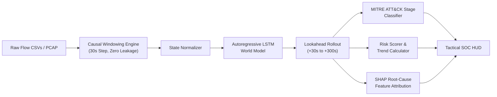

# Bencheck

[](https://bencheck-ai-kp5wcppwygkgfk72eryscq.streamlit.app/)
[](https://www.python.org/downloads/)
[](tests/)
[](LICENSE)

> **Live Deployment**: Access the live interactive SOC console at **[bencheck-ai.streamlit.app](https://bencheck-ai-kp5wcppwygkgfk72eryscq.streamlit.app/)**

Most security dashboards tell you what already happened: an alert fired, a port was probed, or malware touched disk. By the time a ticket lands in the queue, the intruder has already pivoted.

**Bencheck** approaches network security from a different angle. Instead of just flagging past anomalies, it runs an autoregressive sequence model directly on raw flow telemetry to simulate how the attack will unfold over the next 30 to 300 seconds. Think of it as a predictive world model for your network—projecting threat progression, mapping expected stages to MITRE ATT&CK, and calculating exactly which traffic features are driving the risk score.

---

## Why We Built This

Security analysts face two persistent headaches: alert fatigue and blind response delays. When an adversary establishes initial access, the window between lateral movement and data exfiltration can be minutes. 

Bencheck was designed to bridge that gap:
1. **Forecast instead of react**: Projects network state vectors $k$-steps into the future so defenders can cut off routes before exfiltration starts.
2. **Strict causal time tracking**: Prevents future-state leakage during feature extraction. Training and evaluation strictly respect chronological flow boundaries.
3. **Zero-fluff SOC console**: Built for analysts on 1440p desktop monitors as well as on-call engineers triaging incidents on a phone. Clean obsidian-and-cyan palette, no emojis, and zero unnecessary visual bloat.
4. **Local persistence that doesn't hang**: Ingests multi-file CSV dumps up to 400 MB, caches them to disk via Parquet, and keeps your uploaded buffer intact when you hit browser refresh.

---

## How It Works



### 1. Causal Windowing (`src/data/causal_windowing.py`)
Incoming telemetry flows are grouped into temporal causal slices (30-second sliding windows). The engine extracts flow-level metrics—packet rates, inter-arrival time (IAT) variance, SYN/ACK ratios, byte asymmetry, and port diversity—without ever looking ahead into future packets.

### 2. Autoregressive State Rollout (`src/models/forecaster.py`)
An LSTM world model consumes the historical state sequence and recursively predicts future network state vectors. At each forward step $t + k$, the output vector feeds back into the input pipeline to roll out multi-step trajectories across your chosen lookahead horizon.

### 3. MITRE ATT&CK Mapping (`src/models/mitre_mapper.py`)
Projected states are classified across six canonical kill-chain stages:
- **Benign**: Baseline operational traffic within nominal statistical variance.
- **Reconnaissance**: Scanning patterns, IP sweeping, anomalous SYN burst ratios.
- **Initial Access**: External entry attempts, unusual payload spikes, auth surges.
- **Lateral Movement**: Internal subnet traversal, SMB/RDP probing, high fan-out.
- **Command & Control (C2)**: Low-jitter periodic beaconing with tight IAT variance.
- **Exfiltration**: High-volume outbound transfer, sustained large packet trains.

### 4. Game-Theoretic Explainability (`src/models/explainability.py`)
When risk scores spike, black-box predictions aren't enough. Bencheck uses Kernel SHAP to compute feature attribution values in real time, pinpointing the top statistical anomalies (e.g. `dst_port_entropy`, `syn_ack_ratio`) pushing the threat level higher.

---

## Getting Started

### Prerequisites
- Python 3.10, 3.11, or 3.12
- Git

### Installation

```bash
# 1. Clone the repository
git clone https://github.com/Om-Karakoti/Bencheck-AI.git
cd Bencheck-AI

# 2. Set up virtual environment
python -m venv venv

# On Windows:
venv\Scripts\activate
# On Linux / macOS:
source venv/bin/activate

# 3. Install requirements
pip install -r requirements.txt
```

### Running the App

You can either use the live cloud instance directly or launch it locally:

- **Live Cloud Deployment**: [https://bencheck-ai-kp5wcppwygkgfk72eryscq.streamlit.app/](https://bencheck-ai-kp5wcppwygkgfk72eryscq.streamlit.app/)
- **Local Streamlit Dashboard**:
  ```bash
  streamlit run app.py
  ```
  Your browser will automatically open at `http://localhost:8501`.

If you prefer running the lightweight Flask backend with the alternate static interface:

```bash
python run_server.py
```

---

## Using the Dashboard

1. **Telemetry Source Buffer**:
   - Drag and drop one or more packet capture / network flow CSVs (up to 400 MB).
   - Files are automatically saved to local storage (`data/persisted_upload/`), so hitting browser refresh won't wipe your uploaded files.
   - Remove individual files with the `✕ REMOVE` button or wipe everything with `REMOVE ALL FILES (CLEAR)`.
2. **Built-in Presets**:
   - If you don't have a capture file ready, click one of the quick simulation buttons:
     - `KILL-CHAIN ATTACK`: Multi-stage progression from initial probe to exfiltration.
     - `NORMAL BASELINE`: Normal benign network behavior.
     - `DATA EXFILTRATION`: High-volume outbound exfiltration scenario.
3. **Configuring Lookahead**:
   - Adjust the **Lookahead Horizon** slider in the sidebar from $+30\text{s}$ up to $+300\text{s}$ (5 minutes ahead).
4. **Threat Assessment HUD**:
   - Inspect overall infiltration risk, primary threat stage, active trajectory direction, and interactive SHAP driver breakdowns.

---

## Automated Test Suite

We maintain unit and integration tests across data windowing, model convergence, rollout stability, and API routes.

Run the test suite with:

```bash
pytest tests/ -v
```

Expected output:
```
============================== 52 passed, 1 skipped in 52s ==============================
```

---

## Directory Overview

```
bencheck/
├── app.py                      # Main tactical Streamlit SOC dashboard
├── streamlit_app.py            # Streamlit Cloud entrypoint (kept in sync)
├── run_server.py               # Lightweight standalone Flask launcher
├── run_demo.py                 # Offline CLI evaluation and demo runner
├── requirements.txt            # Locked runtime dependencies
├── checkpoints/
│   └── best_world_model.pt     # Pre-trained LSTM sequence model weights
├── data/
│   ├── sample_benign_flows.csv # Benign baseline traffic dataset
│   ├── sample_exfil_flows.csv  # Exfiltration scenario dataset
│   └── synthetic_attack_flows.csv # Multi-stage attack simulation
├── src/
│   ├── data/                   # Causal windowing, splitting, and schema validation
│   └── models/                 # LSTM world model, forecaster, SHAP, and MITRE mapper
├── tests/                      # 52 unit and regression tests
└── web/                        # Alternate static HTML/JS dashboard & API routes
```

---

## Hardware & Performance Notes

- **Memory footprint**: Peak RAM consumption during 400 MB file processing is capped under 1.8 GB via chunked ingestion and type downcasting (`float32` / `int32`).
- **Inference latency**: Replay buffer evaluations and 5-step rollouts run in under 450 ms on standard modern CPU hardware (no dedicated GPU required for inference).
- **Temporal Caching**: Scrubbing the horizon slider reuses in-memory normalizers and feature windows, giving zero-lag slider updates.

---

## License

This project is open-source under the [MIT License](LICENSE). Contributions, bug reports, and pull requests are welcome.
