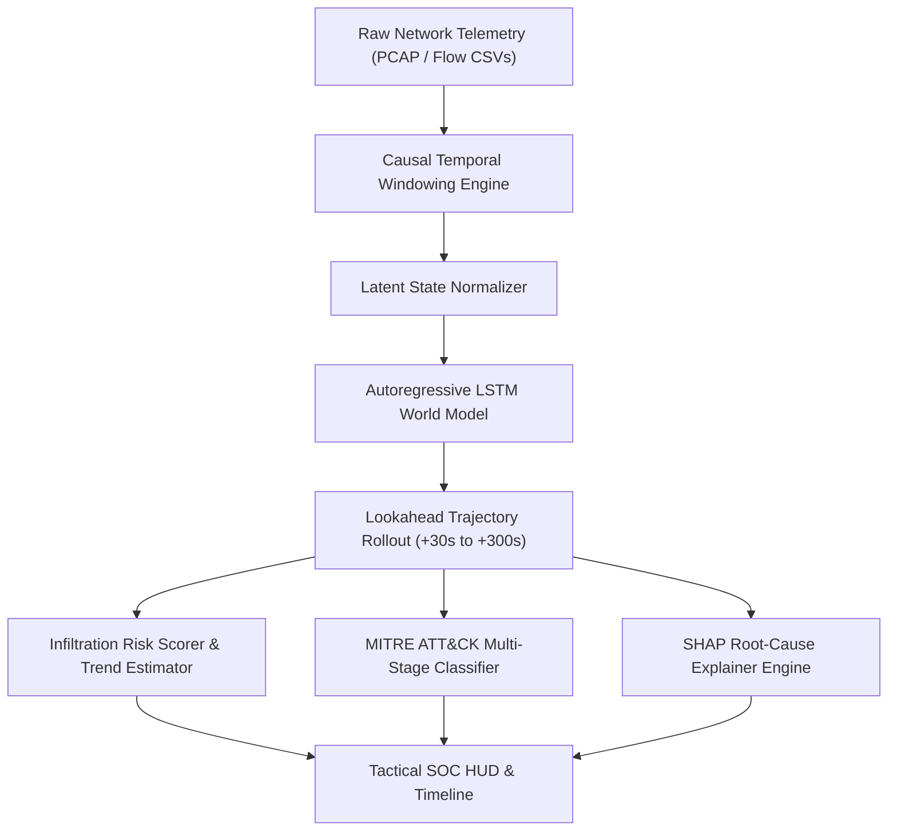

# Bencheck — Cyber Threat World Model SOC

[](https://www.python.org/downloads/)
[](https://streamlit.io/)
[](https://opensource.org/licenses/MIT)

> **Bencheck** is an autoregressive deep learning cyber threat world model designed for Security Operations Centers (SOC). It ingests streaming network packet telemetry, reconstructs internal latent causal dynamics, predicts future attack trajectories (+30s to +300s lookahead), maps multi-stage kill-chains to MITRE ATT&CK, and produces game-theoretic SHAP root-cause attributions.

---

## Key Capabilities

- **Autoregressive World Model Simulation**: Deep causal state extrapolation that forecasts threat escalation across arbitrary lookahead horizons ($+30\text{s}$ to $+300\text{s}$).
- **High-Throughput Telemetry Ingestion Hub**: Multi-file CSV upload supporting up to 400 MB, backed by parquet disk persistence across browser refreshes and individual/bulk source removals.
- **Zero-Hang Cached Inference Engine**: Instantaneous re-rendering and dynamic lookahead slider scrubbing powered by temporal caching.
- **Tactical SOC Interface**: Obsidian (`#040d1a`) and Electric Cyan (`#00e5ff`) military-grade HUD, engineered with zero emojis and responsive typography optimized for both **PC desktops** and **Android mobile viewports**.
- **MITRE ATT&CK Kill-Chain Mapping**: Automatic classification across canonical intrusion phases (*Reconnaissance*, *Initial Access*, *Lateral Movement*, *Command & Control*, *Exfiltration*, and *Benign*).
- **Game-Theoretic Explainability (SHAP)**: Real-time feature attribution explaining precisely why a threat trajectory is predicted to escalate.

---

## Architecture Flow



---

## Quickstart Guide

### 1. Clone & Set Up Environment

```bash
git clone https://github.com/<your-username>/bencheck.git
cd bencheck
python -m venv venv
# Windows:
venv\Scripts\activate
# Linux/macOS:
source venv/bin/activate
```

### 2. Install Dependencies

```bash
pip install -r requirements.txt
```

### 3. Launch the SOC Dashboard

```bash
streamlit run app.py
```
Open your browser at `http://localhost:8501`.

---

## Running the Automated Test Suite

The test suite covers schema validation, causal windowing, autoregressive rollouts, MITRE mapping, and explainability:

```bash
pytest tests/ -v
```

---

## Repository Structure

```
├── app.py                      # Primary Streamlit SOC Console (Bencheck HUD)
├── streamlit_app.py            # Streamlit Cloud deployment entrypoint
├── run_server.py               # Standalone local server runner
├── run_demo.py                 # CLI demo and batch evaluation script
├── src/
│   ├── data/
│   │   ├── causal_windowing.py # Temporal causal feature extractor
│   │   ├── config.py           # Window and pipeline configurations
│   │   ├── dataset.py          # Sequence dataset and normalization
│   │   ├── split.py            # Session-aware train/test splitting
│   │   └── synthetic.py        # Realistic multi-stage attack flow generator
│   └── models/
│       ├── explainability.py   # Kernel SHAP attribution engine
│       ├── forecaster.py       # Autoregressive multi-step rollout
│       ├── infiltration_scorer.py # Dynamic risk calibration
│       ├── lstm_world_model.py # Autoregressive LSTM neural world model
│       ├── mitre_mapper.py     # Canonical MITRE ATT&CK phase mapper
│       └── trainer.py          # Sequence model training loop
├── tests/                      # Automated pytest unit and integration tests
├── web/                        # Alternate static web interface
├── data/                       # Sample datasets and presets
└── requirements.txt            # Python dependencies
```

---

## License

Distributed under the MIT License. See `LICENSE` for more information.
